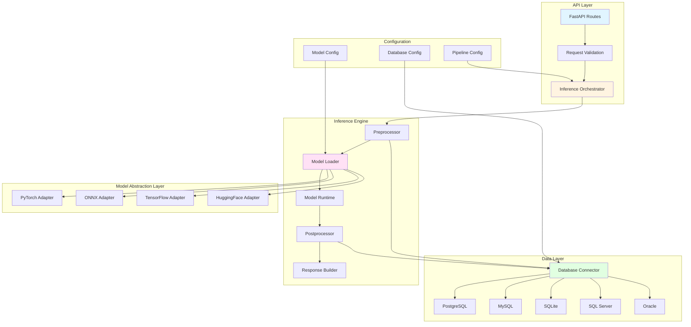
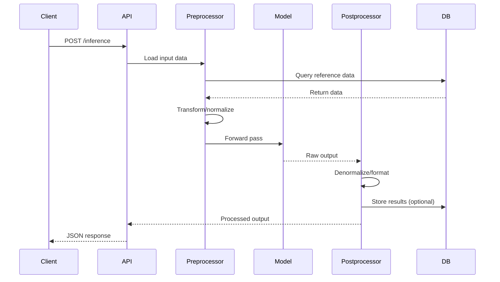

# Generic AI Inference Framework Architecture

## Overview

A flexible, extensible framework for running AI inference with support for:
- **Multiple Model Frameworks**: PyTorch, ONNX, TensorFlow, HuggingFace
- **Any SQL Database**: PostgreSQL, MySQL, SQLite, SQL Server, Oracle
- **Configurable Inference Pipelines**: Preprocessing, inference, postprocessing
- **REST API**: FastAPI-based inference endpoints

## Architecture Diagram



## Core Components

### 1. Model Abstraction Layer

**Purpose**: Provide a unified interface for loading and running inference across different ML frameworks.

**Base Interface**:
```python
class ModelAdapter(ABC):
    """Abstract base class for model adapters"""
    
    @abstractmethod
    def load(self, model_path: str, config: Dict) -> None:
        """Load model from path"""
        pass
    
    @abstractmethod
    def predict(self, inputs: Any) -> Any:
        """Run inference"""
        pass
    
    @abstractmethod
    def get_input_spec(self) -> Dict:
        """Get model input specification"""
        pass
    
    @abstractmethod
    def get_output_spec(self) -> Dict:
        """Get model output specification"""
        pass
```

**Concrete Adapters**:

| Adapter | Framework | Use Case |
|---------|-----------|----------|
| `PyTorchAdapter` | PyTorch | Training, research models |
| `ONNXAdapter` | ONNX Runtime | Production, cross-platform |
| `TensorFlowAdapter` | TensorFlow/Keras | TF models, SavedModel |
| `HuggingFaceAdapter` | Transformers | NLP, vision models |

### 2. Database Abstraction Layer

**Purpose**: Provide a unified interface for querying any SQL database for training/inference data.

**Base Interface**:
```python
class DatabaseConnector(ABC):
    """Abstract base class for database connectors"""
    
    @abstractmethod
    def connect(self, config: Dict) -> None:
        """Establish database connection"""
        pass
    
    @abstractmethod
    def execute_query(self, query: str, params: Dict = None) -> List[Dict]:
        """Execute SQL query and return results"""
        pass
    
    @abstractmethod
    def get_schema(self, table: str) -> Dict:
        """Get table schema"""
        pass
    
    @abstractmethod
    def close(self) -> None:
        """Close connection"""
        pass
```

**Supported Databases**:
- PostgreSQL (via `psycopg2` or `asyncpg`)
- MySQL (via `mysql-connector-python` or `aiomysql`)
- SQLite (via `sqlite3` or `aiosqlite`)
- SQL Server (via `pyodbc`)
- Oracle (via `cx_Oracle`)

### 3. Inference Pipeline

**Purpose**: Orchestrate the complete inference flow with configurable stages.

**Pipeline Stages**:



**Pipeline Configuration**:
```yaml
pipeline:
  name: "exoplanet_generator"
  model:
    type: "pytorch"
    path: "models/transformer_v42.pt"
    device: "cuda"
  
  preprocessing:
    - name: "load_normalization_stats"
      source: "database"
      query: "SELECT * FROM normalization_stats"
    - name: "quantize_input"
      params:
        num_bins: 253
        offset: 3
  
  postprocessing:
    - name: "dequantize_output"
      params:
        num_bins: 253
        offset: 3
    - name: "denormalize"
      source: "stats"
    - name: "validate_system"
  
  database:
    type: "postgresql"
    host: "localhost"
    port: 5432
    database: "exoplanets"
    user: "${DB_USER}"
    password: "${DB_PASSWORD}"
```

### 4. Configuration System

**Purpose**: Centralized configuration for models, databases, and pipelines.

**Configuration Structure**:
```
config/
├── models/
│   ├── pytorch_transformer.yaml
│   ├── onnx_planet_model.yaml
│   └── huggingface_llm.yaml
├── databases/
│   ├── postgresql.yaml
│   ├── mysql.yaml
│   └── sqlite.yaml
├── pipelines/
│   ├── exoplanet_generation.yaml
│   ├── classification.yaml
│   └── generation.yaml
└── main.yaml
```

**Main Configuration**:
```yaml
framework:
  name: "Generic AI Inference Framework"
  version: "1.0.0"
  debug: false

api:
  host: "0.0.0.0"
  port: 8000
  cors_origins: ["*"]

models:
  directory: "./models"
  default_adapter: "pytorch"

databases:
  default_type: "postgresql"
  pool_size: 10
  max_overflow: 20

pipelines:
  directory: "./config/pipelines"
  default: "exoplanet_generation"

logging:
  level: "INFO"
  format: "json"
```

### 5. API Layer

**Purpose**: RESTful API for inference requests.

**Endpoints**:

| Method | Endpoint | Description |
|--------|----------|-------------|
| POST | `/api/v1/inference` | Run inference with specified pipeline |
| GET | `/api/v1/models` | List available models |
| GET | `/api/v1/models/{name}` | Get model details |
| POST | `/api/v1/models/{name}/reload` | Reload model |
| GET | `/api/v1/pipelines` | List available pipelines |
| GET | `/api/v1/databases/health` | Check database connectivity |
| GET | `/api/v1/health` | Framework health check |

**Generic Inference Request**:
```json
{
  "pipeline": "exoplanet_generation",
  "model": "transformer_v42",
  "inputs": {
    "central_mass": 0.5,
    "num_bodies": 3,
    "temperature": 0.8,
    "top_k": 50
  },
  "options": {
    "return_trajectory": true,
    "simulation_timesteps": 10000
  }
}
```

## Directory Structure

```
generic-ai-framework/
├── backend/
│   ├── app/
│   │   ├── __init__.py
│   │   ├── main.py                 # FastAPI application
│   │   ├── api/
│   │   │   ├── __init__.py
│   │   │   ├── routes.py           # API endpoints
│   │   │   └── schemas.py          # Pydantic models
│   │   ├── core/
│   │   │   ├── __init__.py
│   │   │   ├── config.py           # Configuration loader
│   │   │   └── exceptions.py       # Custom exceptions
│   │   ├── models/
│   │   │   ├── __init__.py
│   │   │   ├── base.py             # ModelAdapter ABC
│   │   │   ├── pytorch_adapter.py
│   │   │   ├── onnx_adapter.py
│   │   │   ├── tensorflow_adapter.py
│   │   │   └── huggingface_adapter.py
│   │   ├── databases/
│   │   │   ├── __init__.py
│   │   │   ├── base.py             # DatabaseConnector ABC
│   │   │   ├── postgresql.py
│   │   │   ├── mysql.py
│   │   │   ├── sqlite.py
│   │   │   └── sqlserver.py
│   │   ├── pipelines/
│   │   │   ├── __init__.py
│   │   │   ├── orchestrator.py     # Pipeline orchestration
│   │   │   ├── preprocessor.py     # Preprocessing stages
│   │   │   └── postprocessor.py    # Postprocessing stages
│   │   └── utils/
│   │       ├── __init__.py
│   │       └── logging.py
│   ├── config/
│   │   ├── main.yaml
│   │   ├── models/
│   │   ├── databases/
│   │   └── pipelines/
│   └── requirements.txt
├── models/                          # Model storage
├── tests/
│   ├── test_models/
│   ├── test_databases/
│   └── test_pipelines/
└── docs/
    ├── architecture.md
    ├── api.md
    └── migration_guide.md
```

## Key Design Principles

### 1. Framework Agnostic
- No framework-specific code in core logic
- Adapters handle framework differences
- Easy to add new framework support

### 2. Database Agnostic
- SQL dialect abstraction
- Connection pooling
- Async support for high throughput

### 3. Configuration Driven
- No code changes for new models/pipelines
- YAML-based configuration
- Environment variable support

### 4. Extensible
- Plugin architecture for custom stages
- Middleware support for cross-cutting concerns
- Hook system for lifecycle events

### 5. Production Ready
- Health checks
- Metrics/monitoring hooks
- Graceful shutdown
- Error handling

## Migration Strategy from Exoplanet System

### Phase 1: Core Infrastructure
1. Create base abstractions (`ModelAdapter`, `DatabaseConnector`)
2. Implement PyTorch adapter (reuse existing code)
3. Implement PostgreSQL connector
4. Create configuration system

### Phase 2: Pipeline Migration
1. Extract preprocessing logic from [`inference.py`](backend/app/ml/inference.py)
2. Extract postprocessing logic
3. Create pipeline configuration for exoplanet generation
4. Migrate API routes to generic format

### Phase 3: Additional Adapters
1. Implement ONNX adapter (for browser inference)
2. Implement MySQL/SQLite connectors
3. Add HuggingFace adapter for LLMs

### Phase 4: Enhancements
1. Add async database operations
2. Implement model versioning
3. Add caching layer
4. Implement batch inference

## Dependencies

### Core
- `fastapi` - Web framework
- `pydantic` - Data validation
- `pyyaml` - Configuration parsing
- `python-dotenv` - Environment variables

### Model Frameworks
- `torch` - PyTorch
- `onnxruntime` - ONNX Runtime
- `tensorflow` - TensorFlow
- `transformers` - HuggingFace

### Database Drivers
- `psycopg2-binary` - PostgreSQL
- `mysql-connector-python` - MySQL
- `aiosqlite` - SQLite (async)
- `pyodbc` - SQL Server
- `cx_Oracle` - Oracle

### Utilities
- `sqlalchemy` - ORM (optional)
- `alembic` - Database migrations (optional)
- `prometheus-client` - Metrics (optional)

## Example: Adding a New Model

1. **Create model config** (`config/models/my_model.yaml`):
```yaml
name: "my_model"
type: "pytorch"
path: "models/my_model.pt"
device: "cuda"
input_spec:
  - name: "input_ids"
    shape: [1, 64]
    dtype: "int64"
output_spec:
  - name: "logits"
    shape: [1, 64, 256]
    dtype: "float32"
```

2. **Create pipeline config** (`config/pipelines/my_pipeline.yaml`):
```yaml
name: "my_pipeline"
model: "my_model"
preprocessing:
  - name: "tokenize"
    params:
      max_length: 64
postprocessing:
  - name: "decode_tokens"
```

3. **Use via API**:
```bash
curl -X POST http://localhost:8000/api/v1/inference \
  -H "Content-Type: application/json" \
  -d '{
    "pipeline": "my_pipeline",
    "inputs": {"text": "Hello world"}
  }'
```

## Example: Adding a New Database

1. **Create database config** (`config/databases/my_db.yaml`):
```yaml
type: "postgresql"
host: "localhost"
port: 5432
database: "my_database"
user: "${DB_USER}"
password: "${DB_PASSWORD}"
pool_size: 10
```

2. **Use in pipeline**:
```yaml
preprocessing:
  - name: "load_reference_data"
    source: "database"
    database: "my_db"
    query: "SELECT * FROM reference_table WHERE id = :id"
```

## Next Steps

1. Review and approve this architecture
2. Switch to Code mode to implement
3. Start with Phase 1 (Core Infrastructure)
4. Incrementally migrate existing exoplanet system
